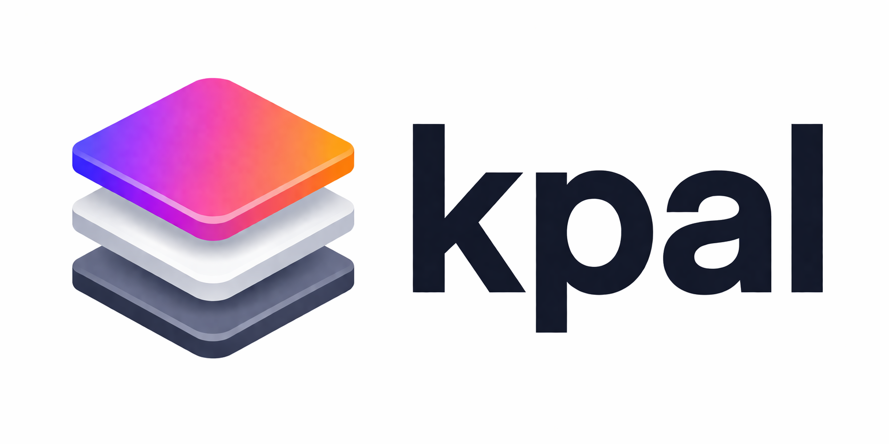

<p align="center">
  
</p>

<p align="center">
  <a href="https://github.com/leon-jakob-schneider/kpal/releases/latest">
    
  </a>
</p>

kpal gives you a cross-platform Kotlin API for device features, then hardens that API with manual QA apps and a device simulator. Use the QA apps when behavior must be proven on real Android and iOS hardware, and use the simulator for cheap integration tests that run quickly in coding-agent feedback loops without a real device or human intervention.

## Add kpal

Use the `device` module for production code:

```yaml
dependencies:
  - ./device
```

Use the `simulator` module from tests or test-only tools:

```yaml
dependencies:
  - ./simulator
```

Published artifacts use this group:

```kotlin
implementation("io.github.leon-jakob-schneider.kpal:device:<version>")
testImplementation("io.github.leon-jakob-schneider.kpal:simulator:<version>")
```

## Use the Device API

Create a platform device and request an audio engine:

```kotlin
import app.miso.audio.AudioSessionConfig
import app.miso.device.DeviceConfig
import app.miso.device.DeviceImpl

val device = DeviceImpl(
    platformContext = platformContext,
    config = DeviceConfig(
        audio = AudioSessionConfig(
            sampleRate = 24_000,
            ioBufferFrames = 1_024,
            preferSpeaker = true,
            voiceProcessing = true,
        ),
    ),
)

val request = device.audio.requestEngine()
val engine = request.engine ?: return

engine.useDuplex { duplex ->
    duplex.playPcm16(pcm16Bytes)
    val inputChunk = duplex.takeNextInputPcm16()
}
```

On Android, pass an Android `Context` as `platformContext`. On iOS, `platformContext` can stay `null`.

## Observe Audio State

Pass an `AudioSessionObserver` when you need route, level, byte-count, or error updates:

```kotlin
import app.miso.audio.AudioError
import app.miso.audio.AudioSessionObserver
import app.miso.audio.AudioSessionState
import app.miso.device.DeviceImpl

val observer = object : AudioSessionObserver {
    override fun onStateChanged(state: AudioSessionState) {
        println("running=${state.isRunning} level=${state.inputLevel}")
        println("route=${state.route}")
    }

    override fun onError(error: AudioError) {
        println(error.message)
    }
}

val device = DeviceImpl(
    platformContext = platformContext,
    audioObserver = observer,
)
```

## Generate Test PCM

Use the shared tone generator for simple playback checks:

```kotlin
import app.miso.audio.Pcm16ToneGenerator

val tone = Pcm16ToneGenerator.sine(
    frequencyHz = 440.0,
    durationMillis = 1_500,
    sampleRate = 24_000,
)
```

## Write Cheap Integration Tests

Use `DeviceSimulator` when the code under test should exercise the same `Device` surface without opening a real microphone or speaker:

```kotlin
import app.miso.audio.Pcm16ToneGenerator
import app.miso.simulator.DeviceSimulator

val device = DeviceSimulator()
val input = Pcm16ToneGenerator.sine(durationMillis = 200)

device.setAudioInputPcm16(input)

val engine = device.audio.requestEngine().engine ?: error("No audio engine")
engine.useDuplex { duplex ->
    val captured = checkNotNull(duplex.takeNextInputPcm16())
    check(captured.contentEquals(input))

    duplex.playPcm16(captured)
}

val output = device.drainAudioOutputPcm16()
check(output.contentEquals(input))
```

Useful simulator controls:

- `setAudioInputPcm16(bytes)`: replace pending simulated microphone input.
- `appendAudioInputPcm16(bytes)`: queue more simulated microphone input.
- `takeNextAudioOutputPcm16()`: read the next speaker output chunk.
- `audioOutputPcm16()`: snapshot all captured speaker output.
- `drainAudioOutputPcm16()`: read and clear speaker output.
- `clearAudioInput()` / `clearAudioOutput()`: reset simulator buffers.

## Run the Android QA App

Build the app:

```bash
./amper build -m device-qa-android-app -p android
```

Run it on a connected Android device or emulator:

```bash
adb devices
./amper run -m device-qa-android-app -p android -d <device-id>
```

Use the app to start capture, play a 440 Hz tone, play captured audio, and inspect route, input level, captured bytes, and played bytes.

## Run the iOS QA App

Build the app:

```bash
./amper build -m device-qa-ios-app -p iosSimulatorArm64
```

Run it on a simulator or connected iOS device:

```bash
xcrun simctl list devices
./amper run -m device-qa-ios-app -p iosSimulatorArm64 -d <device-id>
```

For real-device QA, open `device-qa-ios-app/module.xcodeproj` in Xcode and run the app on an iPhone.

Use the iOS QA suite to validate built-in speaker playback, built-in mic loopback, recording coverage, AirPods playback, and AirPods mic loopback. Export the report at the end of a manual run when you need evidence for a device-specific change.

## Common Local Commands

List modules:

```bash
./amper show modules
```

Build all modules:

```bash
./amper build
```

Build the shared device library:

```bash
./amper build -m device
```

Build the simulator:

```bash
./amper build -m simulator
```
